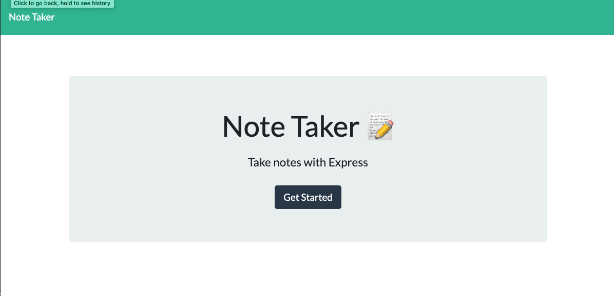
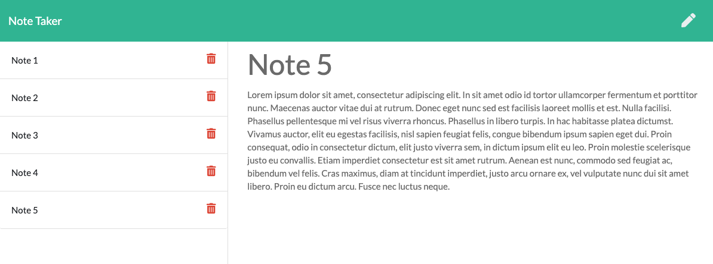

# Homework-11-Express-Note-Taker


    
## Table of Contents
* [Description](#description)
* [Installation](#installation)
* [Usage](#usage)
* [Tests](#test)
* [Questions](#questions)
* [Contributing Authors](#contributors)
* [License](#license)
    
# Description
Homework 11: Express Note Taker is an application that can be used to write, save, and delete notes. It uses an express backend and can save and retrieve note data from a JSON file. This application uses a combination of JavaScript, Node.js, jQuery, HTML, css, and JSON.



    
## Installation
Clone repository to your local drive. Run ```npm install``` to install dependencies.
    
## Usage
The application allows users tom create and save notes. Users can view, as well as delete, previously saved notes.


          
## Tests
Testing can be performed using Postman. All tests currently passing.
            
## Questions
All questions regarding this application can be directed to: 
 
<a href="https://github.com/cascutter">cascutter</a> 

<a href="mailto:cascutter13@gmail.com">cascutter13@gmail.com</a>
    
# Contributing Authors
* Casandra Cutter 
* H/t Danielle Bowman
    
# License
MIT License